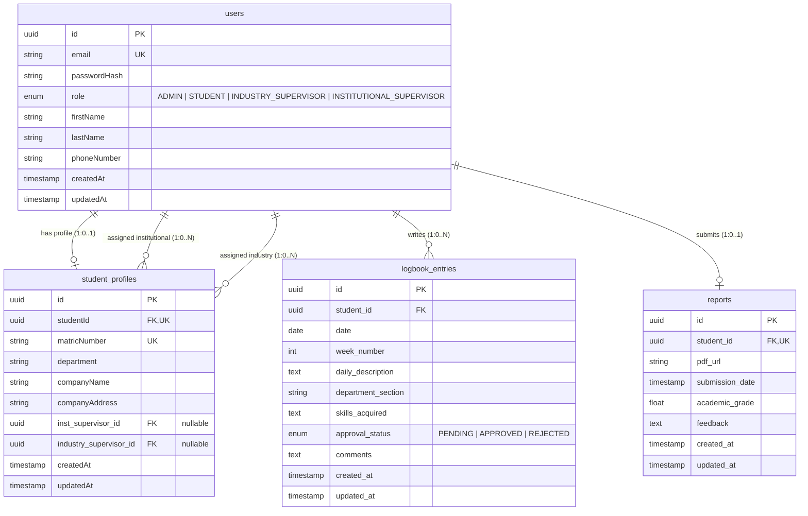

# SIWES Logbook & Report Management System

This project is a decentralized, role-based management application for the Students Industrial Work Experience Scheme (SIWES). It is designed to streamline the logging of daily student activities, facilitate supervisor approvals, and manage final technical report submissions.

---

## 🛠️ Technology Stack

- **Frontend**: Next.js (App Router, TypeScript, Tailwind CSS/Vanilla CSS)
- **Backend API**: Node.js & Express (TypeScript, Prisma ORM)
- **Database**: PostgreSQL (hosted on Supabase)
- **Authentication**: NextAuth.js (Auth.js) Credentials Provider
- **File Storage**: Supabase Storage Buckets (for PDF report uploads)

---

## 📂 Project Directory Structure

```text
SIWES MANAGEMENT SYSTEM/
├── backend/                        # Node.js/Express Backend API
│   ├── prisma/                     # Database Schema & Migrations
│   │   ├── migrations/
│   │   │   └── 01_init.sql         # Raw SQL DDL Migration file
│   │   └── schema.prisma           # Prisma ORM Schema
│   ├── src/                        # API Source Code
│   │   ├── controllers/            # Route handlers (auth, logbook, report)
│   │   ├── middleware/             # Express middlewares (JWT check, role authorization)
│   │   ├── routes/                 # Express REST endpoint routing
│   │   ├── services/               # Database query layer using Prisma Client
│   │   ├── types/                  # Shared types and Express request extensions
│   │   └── index.ts                # Express application entryway
│   ├── .env.example                # Template for environment configuration
│   ├── package.json                # Project dependencies and npm scripts
│   ├── tsconfig.json               # TypeScript compiler options
│   └── yarn.lock                   # Package lockfile
├── frontend/                       # Next.js Frontend Web App
│   ├── src/
│   │   ├── app/                    # Next.js App Router (pages & APIs)
│   │   │   ├── api/auth/[...nextauth]/route.ts # NextAuth authentication handler
│   │   │   ├── dashboard/          # Dynamic dashboard (Student / Supervisor / Admin)
│   │   │   └── page.tsx            # Main Landing/Login page
│   │   ├── components/             # Reusable UI elements (Logbook form, Sidebar)
│   │   ├── hooks/                  # React state hooks
│   │   └── lib/                    # Shared configurations (NextAuth options, api client)
│   ├── package.json
│   └── tsconfig.json
└── README.md                       # Main workspace documentation (This file)
```

---

## 🗄️ Database Architecture & Flat Schema

The database design uses a **flat hierarchy** layout. Rather than nesting logbooks and reports under deep profile relations, both `logbook_entries` and `reports` map directly to the student’s **User ID** to simplify routing and enhance database query speeds. 

Role-based scoping is handled through optional foreign keys in `student_profiles`, mapping to their respective institutional and industry supervisors.

### Entity Relationship Model



---

## 🔑 Authentication Flow & NextAuth.js Integration

Authentication uses **NextAuth.js Credentials Provider** inside Next.js.
1. The user logs in via the UI using their Email and Password.
2. NextAuth triggers the `authorize` callback, calling the Backend Express `/api/auth/login` endpoint.
3. The Backend verifies the credentials against the database via Prisma and returns a signed JWT containing user properties (ID, Name, Email, and **Role**).
4. NextAuth saves the user's role and ID in the JWT session, allowing:
   - Client-side route-protection based on user role.
   - Immediate role-based dashboard rendering (Student logs directly to logbook; Supervisors go to grading/approval views).

---

## 📁 Supabase Storage for Reports

PDF report submissions are processed as follows:
- When a student uploads a PDF, the Next.js client uploads the file directly to the Supabase Storage Bucket `siwes-reports` using the Supabase Client SDK.
- Upon successful upload, Supabase returns a public/private URL.
- The Next.js client sends the URL path to the backend, which saves it as `pdfUrl` in the `reports` table under the student's User ID.

---

## 🚀 Setting Up the Backend

### Prerequisites
- Node.js installed on your machine.
- PostgreSQL database or a Supabase project connection string.

### Configuration
1. Navigate to the backend directory:
   ```bash
   cd backend
   ```
2. Create a `.env` file from the example template:
   ```bash
   cp .env.example .env
   ```
3. Update the `DATABASE_URL` in `.env` with your Supabase database connection string.

### Installation
Install backend dependencies:
```bash
yarn install
```

### Validate Schema Integrity
Compile-validate the Prisma schema configuration:
```bash
yarn db:validate
```
*(Runs `prisma validate` to verify entity integrity, structural keys, and relationships).*
